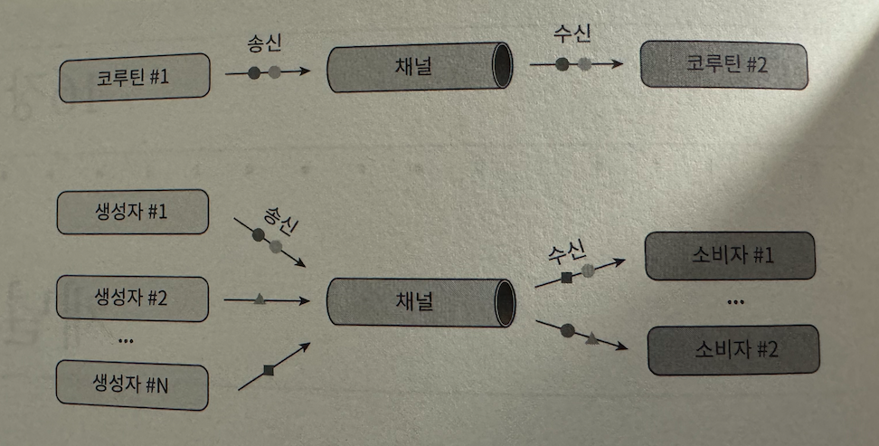
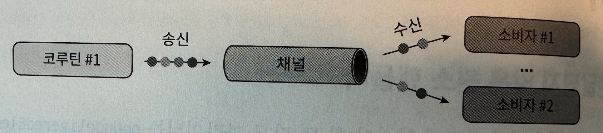
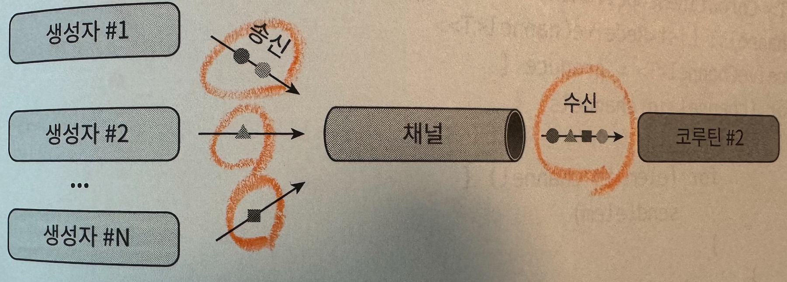
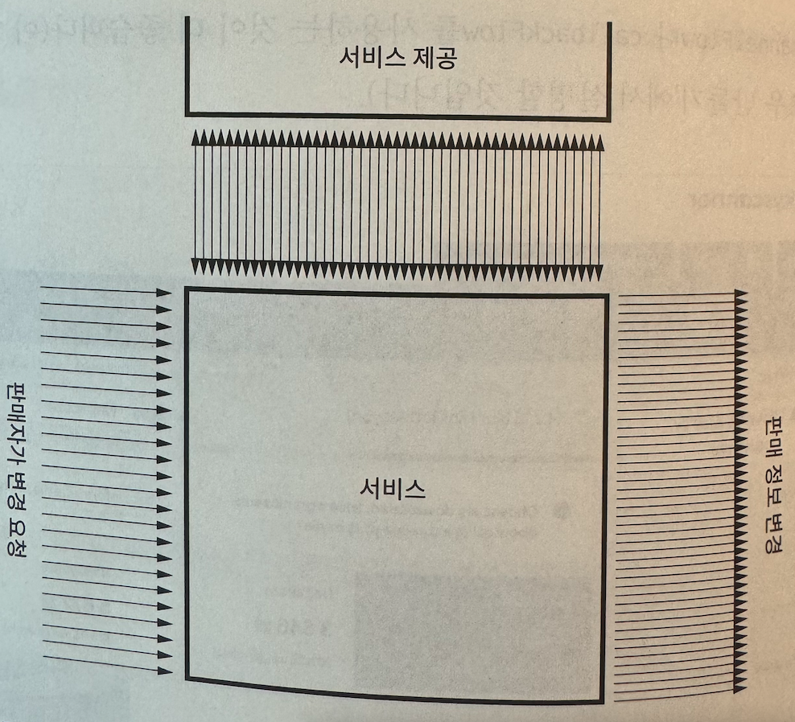
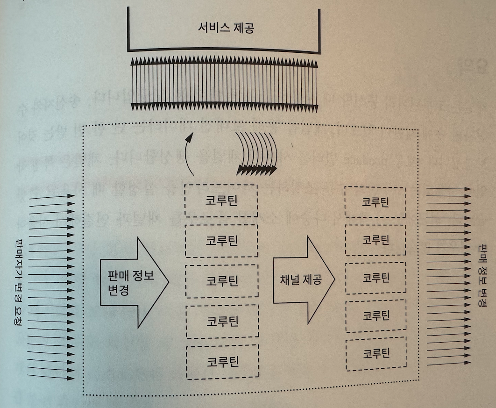

# 채널

- 코루틴끼리의 통신을 위한 기본적인 방법으로 채널 API가 추가되었다



## Channel 관련 인터페이스

- SendChannel
    - 원소를 보내거나(또는 더하거나) 채널을 닫는 용도로 사용된다
    - send는 채널의 용량이 다 찼을 때 중단된다
- ReceiveChannel
    - 원소를 받을 때(또는 꺼낼 때) 사용된다
    - receive를 호출했는데 채널에 원소가 없다면 코루틴은 원소가 들어올 때까지 중단된다
- 특징
    - 채널은 송신자와 수신자의 수에 제한이 없다.
    - 하지만 채널의 양쪽 끝에 각각 하나의 코루틴만 있는 경우가 가장 일반적이다

- 다음은 채널을 통해 5회 데이터를 송신을 하고 수신된 데이터를 출력하는 예제이다

```jsx
suspend fun main(): Unit = coroutineScope {
    val channel = Channel<Int>()
    launch {
        repeat(5) { index ->
            delay(1000)
            println("Producing next one")
            channel.send(index * 2)
//            if (index == 3) {
//                throw RuntimeException("test")
//            }
        }
        channel.close()
    }

    launch {
        for (element in channel) {
            println(element)
        }
    }
}
```

## 다음의 문제는 무엇일까?

- 원소를 보내는 방식의 문제점은 채널을 닫는 걸 깜박하기 쉽다는 것이다.
- 예외로 인해 코루틴이 원소를 보내는 걸 중단하면, 다른 코루틴은 원소를 영원히 기다려야 한다

> 하지만 실제로 RuntimeException을 발생시켜보면 channel이 disconect 되어진걸 확인할수 있다… 흠.. 그럼 크게 이슈 없는게 아닐까..?
>

```jsx
Exception in thread "main" java.lang.RuntimeException: test
	at Chap16_3Kt$main$2$1.invokeSuspend(Chap16-3.kt:19)
	at kotlin.coroutines.jvm.internal.BaseContinuationImpl.resumeWith(ContinuationImpl.kt:33)
	at kotlinx.coroutines.DispatchedTask.run(DispatchedTask.kt:108)
	at kotlinx.coroutines.scheduling.CoroutineScheduler.runSafely(CoroutineScheduler.kt:584)
	at kotlinx.coroutines.scheduling.CoroutineScheduler$Worker.executeTask(CoroutineScheduler.kt:793)
	at kotlinx.coroutines.scheduling.CoroutineScheduler$Worker.runWorker(CoroutineScheduler.kt:697)
	at kotlinx.coroutines.scheduling.CoroutineScheduler$Worker.run(CoroutineScheduler.kt:684)
Disconnected from the target VM, address: '127.0.0.1:50021', transport: 'socket'
```

### 그럼 어떻게 해결할 수 있을까?

- ReceiveChannel을 반환하는 코루틴 빌더인 produce 함수를 사용하는 것이 좀더 편리하다
- produce 함수는 빌더로 시작된 코루틴이 어떻게 종료되든 상관없이 채널을 닫기 때문에 close를 반드시 호출할 필요는 없고, 채널에서 가장 많이 사용하는 방식이다

```jsx
suspend fun main(): Unit = coroutineScope {
    val channel = produce (capacity = Channel.UNLIMITED) {
        repeat(5) { index ->
            send(index * 2)
            delay(100)
            println(index)
        }
    }

    delay(1000)
    launch {
        for (element in channel) {
            println(element)
        }
    }
}
```

# 채널 타입

- 설정한 용량 크기에 따라 채널을 네 가지로 구분할 수 있다
- 무제한(Unlimited) : 제한이 없는 용량 버처를 가진 Channel.UNLIMITED로 설정된 채널로, send가 중단되지 않는다

    ```jsx
    suspend fun main(): Unit = coroutineScope {
        val channel = produce(capacity = Channel.UNLIMITED) {
            repeat(5) { index ->
                send(index * 2)
                delay(100)
                println("Sent")
            }
        }

        delay(1000)
        for (element in channel) {
            println(element)
            delay(1000)
        }
    }
    ```

- 버퍼(Buffered) : 특정 용량 크기 또는 Channel.BUFFERED(기본값은 64이며 JVM의 kotlinx.coroutines.channels.defaultBuffer를 설정하면 오버라이드할 수 있다)

    ```jsx
    suspend fun main(): Unit = coroutineScope {
        val channel = produce(capacity = 3) {
            repeat(5) { index ->
                send(index * 2)
                delay(100)
                println("Sent")
            }
        }

        delay(1000)
        for (element in channel) {
            println(element)
            delay(1000)
        }
    }
    ```

- 랑데뷰(Rendezvous) : 용량이 0이거나 Channel.RENDEZVOUS(용량이 0이다)인 채널로, 송신자와 수신자가 만날 때만 원소를 교환한다

    ```jsx
    suspend fun main(): Unit = coroutineScope {
        val channel = produce { // 기본값이 랑데뷰이다!!
            // or produce(capacity = Channel.RENDEZVOUS) {
            repeat(5) { index ->
                send(index * 2)
                delay(100)
                println("Sent")
            }
        }

        delay(1000)
        for (element in channel) {
            println(element)
            delay(1000)
        }
    }
    ```

- 융합(Conflated) : 버퍼 크기가 1인 채널로, 새로운 원소가 이전 원소를 대체한다

    ```jsx
    suspend fun main(): Unit = coroutineScope {
        val channel = produce(capacity = Channel.CONFLATED) {
            repeat(5) { index ->
                send(index * 2)
                delay(100)
                println("Sent")
            }
        }

        delay(1000)
        for (element in channel) {
            println(element)
            delay(1000)
        }
    }
    ```


# 버퍼 오버플로일 때

- 채널에 버퍼가 가즉 찼을 때 행동을 정의할 수 있다
- SUSPEND : 버퍼가 가즉 찼을 때, send 메서드가 중단된다

    ```jsx
    suspend fun main(): Unit = coroutineScope {
        val channel = Channel<Int>(
            capacity = 2,
            onBufferOverflow = BufferOverflow.SUSPEND
        )

        launch {
            repeat(5) { index ->
                channel.send(index * 2)
                delay(100)
                println("Sent")
            }
            channel.close()
        }

        delay(1000)
        for (element in channel) {
            println(element)
            delay(1000)
        }
    }
    ```

- DROP_OLDEST : 버퍼가 가득 찼을 때, 가장 오래된 원소가 제거된다

    ```jsx
    suspend fun main(): Unit = coroutineScope {
        val channel = Channel<Int>(
            capacity = 2,
            onBufferOverflow = BufferOverflow.DROP_OLDEST
        )

        launch {
            repeat(5) { index ->
                channel.send(index * 2)
                delay(100)
                println("Sent")
            }
            channel.close()
        }

        delay(1000)
        for (element in channel) {
            println(element)
            delay(1000)
        }
    }
    ```

- DROP_LATEST : 버퍼가 가즉 찼을 때, 가장 최근의 원소가 제거된다

    ```jsx
    suspend fun main(): Unit = coroutineScope {
        val channel = Channel<Int>(
            capacity = 2,
            onBufferOverflow = BufferOverflow.DROP_LATEST
        )

        launch {
            repeat(5) { index ->
                channel.send(index * 2)
                delay(100)
                println("Sent")
            }
            channel.close()
        }

        delay(1000)
        for (element in channel) {
            println(element)
            delay(1000)
        }
    }
    ```

    # 팬아웃(Fan-out)

  

    - 여러 개의 코루틴이 하나의 채널로부터 원소를 받을 수도 있다.

    ```jsx
    fun CoroutineScope.produceNumbers() = produce {
        repeat(10) {
            delay(100)
            send(it)
        }
    }

    fun CoroutineScope.launchProcessor(
        id: Int,
        channel: ReceiveChannel<Int>
    ) = launch {
        for (msg in channel) {
            println("#$id received $msg")
        }
    }

    suspend fun main(): Unit = coroutineScope {
        val channel = produceNumbers()
        repeat(3) { id ->
            delay(10)
            launchProcessor(id, channel)
        }
    }
    ```

    > 그런데 왜 repeat이 3인데 계속 수행될까…?
    >

    # 팬인(Fan-in)

  

    - 여러 개의 코루틴이 하나의 채널로 원소를 전송할 수 있다

    ```jsx
    suspend fun sendString(
        channel: SendChannel<String>,
        text: String,
        time: Long
    ) {
        while (true) {
            delay(time)
            channel.send(text)
        }
    }

    fun main() = runBlocking {
        val channel = Channel<String>()
        launch { sendString(channel, "foo", 200L) }
        launch { sendString(channel, "BAR!", 500L) }
        repeat(50) {
            println("${it} , ${channel.receive()}")
        }
        coroutineContext.cancelChildren()
    }
    ```


# 실제 사용 예



### 시나리오

- 아마존과 같은 온라인 쇼핑몰을 운영한다고 하자
- 서비스는 엄청난 수의 판매자들이 제공하는 상품 정보가 변경되는 것을 감지해야 한다
- 판매자가 정보를 변경할 때마다 갱신해야 할 상품 리스트를 찾고, 하나씩 업데이트하게 된다

### 문제점

- 내부적인 예외가 발생하거나 서버가 재개되면 어디서 멈췄는지 단서를 남기기 어렵다
- 대규모의 상품을 제공하는 판매자가 오랫동안 서버를 붙들고 있으면, 다른 작은 규모의 판매자는 변경하기 위해 한참을 기다려야 한다

### 채널을 활용한 해결 방안



- 첫 번째 채널은 처리해야 할 판매자를 가지고 있으며, 두 번째 채널은 갱신해야 할 상품을 가지고 있다
- 두 번째 채널의 버퍼는 이미 처리해야 할 상품이 많을 경우 서비스가 더 많은 상품을 받는 걸 방지한다
- 따라서 서버는 같은 시간에 갱신해야 할 상품의 수를 조절할 수 있다

```jsx
suspend fun handleOfferUpdates() = coroutineScope {
   val sellerChannel = listenOnSellerChanges()

   val offerToUpdateChannel = produce(capacity = UNLIMITED) {
       repeat(NUMBER_OF_CONCURRENT_OFFER_SERVICE_REQUESTS) {
           launch {
               for (seller in sellerChannel) {
                   val offers = offerService
                       .requestOffers(seller.id)
                   offers.forEach { send(it) }
               }
           }
       }
   }

   repeat(NUMBER_OF_CONCURRENT_UPDATE_SENDERS) {
       launch {
           for (offer in offerToUpdateChannel) {
               sendOfferUpdate(offer)
           }
       }
   }
}
```

- 채널은 특정 작업에 사용되는 코루틴의 수를 조절하는 파이프라인을 설정할 때 사용될 수 있다.

# 셀렉트

- 코루틴은 가장 먼저 완료되는 코루틴의 결과를 기다리는 select 함수를 제공한다.
- 또한 여러 개의 채널 중 버퍼에 남은 공간이 있는 채널을 먼저 확인하여 데이터를 보내거나, 이용 가능한 원소가 있는 채널로부터 데이터를 받을 수 있는지 여부도 확인할 수 있다
- 코루틴 사이에 경합을 일으키거나, 여러개의 데이터 소스로부터 나오는 결괏값을 합칠 수도 있다

## 지연되는 값 선택하기

- 다음 예제는 select 표현식이 하나의 비동기 작업이 완료됨과 동시에 끝나게 되어 결괏값을 반환한다는 것을 알 수 있다

```jsx
suspend fun requestData1(): String {
    delay(100_000)
    return "Data1"
}

suspend fun requestData2(): String {
    delay(1000)
    return "Data2"
}

val scope = CoroutineScope(SupervisorJob())

suspend fun askMultipleForData(): String {
    val defData1 = scope.async { requestData1() }
    val defData2 = scope.async { requestData2() }
    return select {
        defData1.onAwait { it }
        defData2.onAwait { it }
    }
}

suspend fun main(): Unit = coroutineScope {
    println(askMultipleForData())
}
```

- 외의 예제를 보면 외부의 스코프로부터 async가 시작된다
- 따라서 askMultipleForData를 시작하는 코루틴을 취소하면, 외부의 스코프인 비동기 태스크는 취소가 되지 않는다
- coroutineScope를 사용하면 자식 코루틴도 기다리게 되며, 다음 예제에서 확인할 수 있듯이 1초가 아닌 100초 후에서야 Data2를 결과로 받는다

```jsx
suspend fun askMultipleForData2(): String = coroutineScope {
    select {
        async { requestData1() }.onAwait { it }
        async { requestData2() }.onAwait { it }
    }
    // .also { coroutineContext.cancelChildren() }
}

suspend fun main(): Unit = coroutineScope {
    println(askMultipleForData2())
}
```

- async와 select를 사용하면 코루틴끼리 경합하는 상황을 쉽게 수현할 수 있지만, 스코프를 명시적으로 취소해야 한다.
- select가 값을 생성하고 나서 also를 호출한 뒤 다른 코루틴을 취소할 수 있지만 이는 복잡하기 때문에, 많은 개발자는 헬퍼 함수를 정의하거나 raceOf 함수를 지원하는 외부 라이브러리를 사용한다

```jsx
suspend fun askMultipleForData3(): String = raceOf(
    { requestData1() },
    { requestData2() }
)

suspend fun main(): Unit = coroutineScope {
    println(askMultipleForData3())
}
```

# 채널에서 값 선택하기

- select 함수는 채널에서도 사용할 수 있다. 주요 함수는 다음과 같다
    - onReceive : 채널이 값을 가지고 있을 때 선택된다
    - onReceiveCatching : 채널이 값을 가지고 있거나 닫혔을 때 선택된다
    - onSend : 채널의 버퍼에 공간이 있을 때 선택된다

```jsx
suspend fun CoroutineScope.produceString(
    s: String,
    time: Long
) = produce {
    while (true) {
        delay(time)
        send(s)
    }
}

fun main() = runBlocking {
    val fooChannel = produceString("foo", 210L)
    val barChannel = produceString("BAR", 500L)

    repeat(7) {
        select {
            fooChannel.onReceive {
                println("From fooChannel: $it")
            }
            barChannel.onReceive {
                println("From barChannel: $it")
            }
        }
    }

    coroutineContext.cancelChildren()
}
```

- 셀렉트 함수에서 onSend를 호출하면 버퍼에 공간이 있는 채널을 선택해 데이터를 전송하는 용도로 사용할 수 있다

```jsx
fun main(): Unit = runBlocking {
    val c1 = Channel<Char>(capacity = 2)
    val c2 = Channel<Char>(capacity = 2)

    // Send values
    launch {
        for (c in 'A'..'H') {
            delay(400)
            select<Unit> {
                c1.onSend(c) { println("Sent $c to 1") }
                c2.onSend(c) { println("Sent $c to 2") }
            }
        }
    }

    // Receive values
    launch {
        while (true) {
            delay(1000)
            val c = select<String> {
                c1.onReceive { "$it from 1" }
                c2.onReceive { "$it from 2" }
            }
            println("Received $c")
        }
    }
}
```

- select는 가장 먼저 완료되는 코루틴의 결괏값을 기다릴 때나, 여러 개의 채널 중 전송 또는 수신 가능한 채널을 선택할 때 유용하다
- 주로 채널에서 작동하는 다양한 패턴을 구현할 때 사용하지만, async 코루틴의 경합을 구현할 때도 사용할 수 있다